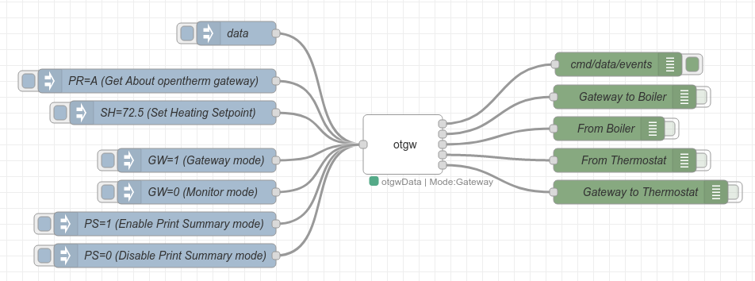

Use this to connect to an [OpenTherm Gateway (OTGW)](http://otgw.tclcode.com/index.html)
==
**Configuration**

Specify a name an the serial device to which the OTGW is connected.

**Input**

Set topic to 'cmd' to send a command to the OTGW. The payload contains the OTGW command.

Set topic to 'data' to receive full set of latest data.

Results will the send to first output.


**Outputs**
* 1st output will contains results of input topics 'cmd' and 'data' and for events, printSummary mode and otgwErrors. The topic will tell what the payload is 'cmd', 'data', 'event', 'printSummary' or 'otgwError'.
* 2nd output will contain updates "Gateway to Boiler"  (status == "R")
* 3rd output will contain updates "From Boiler"  (status == "B")
* 4th output will contain updates "From thermostat"  (status == "T")
* 5th output will contain updates "Gateway to thermostat"  (status == "A")

**Example:**



```json
[{"id":"6ddf1fe5.fe5f1","type":"tab","label":"OpenTherm Gateway","disabled":false,"info":""},{"id":"f3d55c2b.34fd38","type":"debug","z":"6ddf1fe5.fe5f1","name":"cmd/data/events","active":true,"tosidebar":true,"console":false,"tostatus":false,"complete":"true","targetType":"full","statusVal":"","statusType":"auto","x":832,"y":159,"wires":[]},{"id":"b042e675.4d869","type":"debug","z":"6ddf1fe5.fe5f1","name":"Gateway to Boiler","active":false,"tosidebar":true,"console":false,"tostatus":false,"complete":"true","targetType":"full","statusVal":"","statusType":"auto","x":840,"y":200,"wires":[]},{"id":"17229d10.ac9cbb","type":"debug","z":"6ddf1fe5.fe5f1","name":"From Boiler","active":false,"tosidebar":true,"console":false,"tostatus":false,"complete":"true","targetType":"full","statusVal":"","statusType":"auto","x":820,"y":240,"wires":[]},{"id":"18905ec7.5ae3a9","type":"debug","z":"6ddf1fe5.fe5f1","name":"From Thermostat","active":false,"tosidebar":true,"console":false,"tostatus":false,"complete":"true","targetType":"full","statusVal":"","statusType":"auto","x":840,"y":280,"wires":[]},{"id":"6882a4f5.0dfa04","type":"debug","z":"6ddf1fe5.fe5f1","name":"Gateway to Thermostat","active":false,"tosidebar":true,"console":false,"tostatus":false,"complete":"true","targetType":"full","statusVal":"","statusType":"auto","x":860,"y":320,"wires":[]},{"id":"fb84cace.f8719","type":"inject","z":"6ddf1fe5.fe5f1","name":"PR=A (Get About opentherm gateway)","props":[{"p":"payload"},{"p":"topic","vt":"str"}],"repeat":"","crontab":"","once":false,"onceDelay":0.1,"topic":"cmd","payload":"PR=A","payloadType":"str","x":250,"y":180,"wires":[["eb3eec5.bf1469"]]},{"id":"eb3eec5.bf1469","type":"otgw","z":"6ddf1fe5.fe5f1","name":"","serialdevice":"/dev/ttyUSB0","baudrate":9600,"dataBits":8,"stopBits":1,"parity":"none","rtscts":false,"xon":false,"xoff":false,"xany":false,"debug":true,"x":560,"y":260,"wires":[["f3d55c2b.34fd38"],["b042e675.4d869"],["17229d10.ac9cbb"],["18905ec7.5ae3a9"],["6882a4f5.0dfa04"]]},{"id":"addec53f.3a5fa","type":"inject","z":"6ddf1fe5.fe5f1","name":"data","props":[{"p":"topic","vt":"str"}],"repeat":"","crontab":"","once":false,"onceDelay":0.1,"topic":"data","x":350,"y":120,"wires":[["eb3eec5.bf1469"]]},{"id":"508597ac.a5ac5","type":"inject","z":"6ddf1fe5.fe5f1","name":"SH=72.5 (Set Heating Setpoint)","props":[{"p":"payload"},{"p":"topic","vt":"str"}],"repeat":"","crontab":"","once":false,"onceDelay":0.1,"topic":"cmd","payload":"SH=72.5","payloadType":"str","x":270,"y":220,"wires":[["eb3eec5.bf1469"]]},{"id":"b49d723b.99df38","type":"inject","z":"6ddf1fe5.fe5f1","name":"PS=1 (Enable Print Summary mode)","props":[{"p":"payload"},{"p":"topic","vt":"str"}],"repeat":"","crontab":"","once":false,"onceDelay":0.1,"topic":"cmd","payload":"PS=1","payloadType":"str","x":260,"y":360,"wires":[["eb3eec5.bf1469"]]},{"id":"cd86f477.9e932","type":"inject","z":"6ddf1fe5.fe5f1","name":"PS=0 (Disable Print Summary mode)","props":[{"p":"payload"},{"p":"topic","vt":"str"}],"repeat":"","crontab":"","once":false,"onceDelay":0.1,"topic":"cmd","payload":"PS=0","payloadType":"str","x":260,"y":400,"wires":[["eb3eec5.bf1469"]]},{"id":"c2115ecb.a067","type":"inject","z":"6ddf1fe5.fe5f1","name":"GW=1 (Gateway mode)","props":[{"p":"payload"},{"p":"topic","vt":"str"}],"repeat":"","crontab":"","once":false,"onceDelay":0.1,"topic":"cmd","payload":"GW=1","payloadType":"str","x":300,"y":280,"wires":[["eb3eec5.bf1469"]]},{"id":"b0a05fc8.a32cb8","type":"inject","z":"6ddf1fe5.fe5f1","name":"GW=0 (Monitor mode)","props":[{"p":"payload"},{"p":"topic","vt":"str"}],"repeat":"","crontab":"","once":false,"onceDelay":0.1,"topic":"cmd","payload":"GW=0","payloadType":"str","x":300,"y":320,"wires":[["eb3eec5.bf1469"]]}]
```
